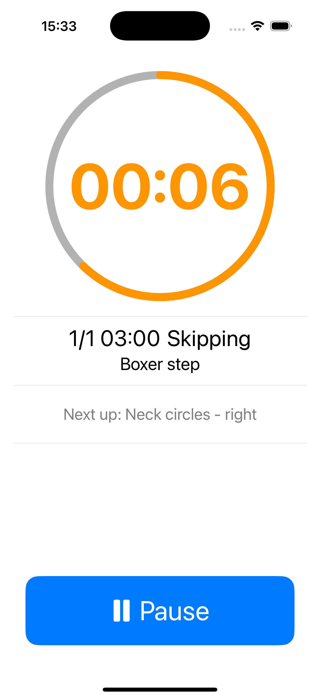
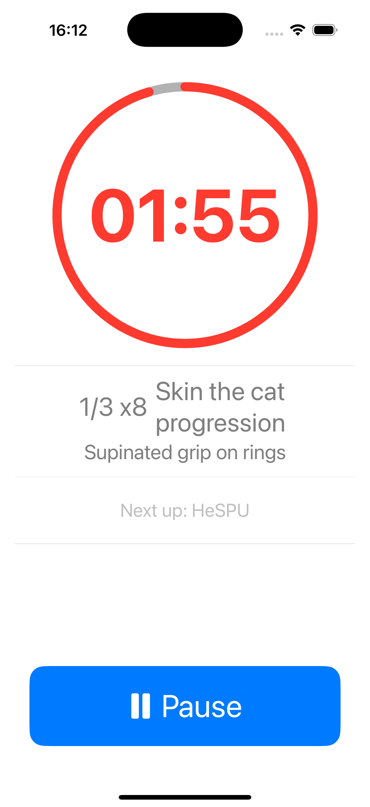
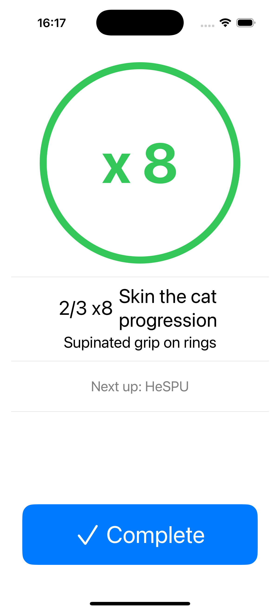

# Training Tracker

A minimalistic SwiftUI iOS app for guided workout routines with timer-based and repetition-based exercises. Suitable for calisthenics, weightlifting, and interval workouts.

## Screenshots

<p align="center">
  
  
</p>

<p align="center">
  
  
</p>

## Features

- **Structured Workouts**: JSON-defined workout routines with nested exercise groups. It supports supersets.
- **Mixed Exercise Types**: Support for both timed exercises and repetition-based exercises.
- **Audio Feedback**: Sound cues for exercise prepare/start/end transitions.
- **Progress Tracking**: Visual indicators for current exercise, sets, weight, time and upcoming exercise.
- **Pause/Resume**: Full control over workout progression.
- **Flexible Rest Periods**: Configurable rest between exercises and exercise groups.
- **Flexible Prepare Time**: Configurable preparation time for timed exercises.

### App Functionality

The Training Tracker guides users through comprehensive workout routines with:

- **Preparation Phase**: configurable countdown before timed exercises to get ready.
- **Exercise Execution**: Clean timer interface showing current exercise, duration/reps/weight, and progress.
- **Rest Management**: Automatic rest periods between exercises with countdown timers. No interaction needed.
- **Set Tracking**: Visual indicators showing current set progress and upcoming exercises.
- **Sound Feedback**: Audio cues mark transitions between phases for hands-free operation.

## Getting Started

### Prerequisites
- Xcode 15.2 or later
- iOS 17.2 or later
- Swift 5.0

### Installation

1. Clone the repository
2. Open `Training Tracker.xcodeproj` in Xcode
3. Select the "Training Tracker" scheme
4. Build and run with `⌘+R`

### Running Tests

- Run all tests: `⌘+U` in Xcode
- Run specific test: Select test method and use `⌘+U`

## Workout Configuration

Workouts are defined in JSON files located in the `Resources/` directory:

- `workoutRoutine_real.json` - Full workout routine (currently active)
- `workoutRoutine.json` - Basic workout template
- `workoutRoutine_flo.json` - Alternative routine

### JSON Structure

```json
{
  "name": "Workout Name",
  "exercisesGroups": [
    {
      "name": "Exercise Group",
      "restInBetween": 90,
      "restAtTheEnd": 120,
      "exercises": [
        {
          "name": "Timed Exercise",
          "description": "Exercise description",
          "prepTimes": [10],
          "durations": [180],
          "numberOfSets": 1
        },
        {
          "name": "Rep Exercise", 
          "repetitions": [10, 12, 15],
          "numberOfSets": 3
        }
      ]
    }
  ]
}
```

### Exercise Types

- **Timed Exercises**: Use `durations` array for exercise duration in seconds.
- **Repetition Exercises**: Use `repetitions` array for rep counts per set.
- **Preparation Time**: Optional `prepTimes` for setup before timed exercises.
- **Rest Periods**: Configure `restInBetween` exercises and `restAtTheEnd` of groups.

## Architecture

The app follows an MVC pattern with Observable models:

- **Models**: `@Observable` classes for state management (`RoutineModel`, `AppLifecycleModel`).
- **Controllers**: Business logic coordinators (`RoutineController`, `TimerController`).
- **Views**: SwiftUI views that observe models and trigger actions.

### Key Components

- `TrainingLifecycleView`: Root view managing app state transitions.
- `RoutineController`: Orchestrates workout progression.
- `Step`: Core data structure representing workout steps.
- `SoundPlayer`: Audio feedback system.

## Testing

The project uses SwiftMock:

```swift
let mockController = Mock<RoutineCtrl>.create()
mockController.expect { $0.onStepCompletion() }
// ... exercise system under test
mockController.verify()
```

## Contributing

1. Follow existing code patterns and architecture
2. Add tests for new functionality
3. Update JSON schemas if modifying workout structure
4. Ensure audio feedback works for new exercise types

## License

This project is licensed under the MIT License - see the [LICENSE.md](LICENSE.md) file for details.
